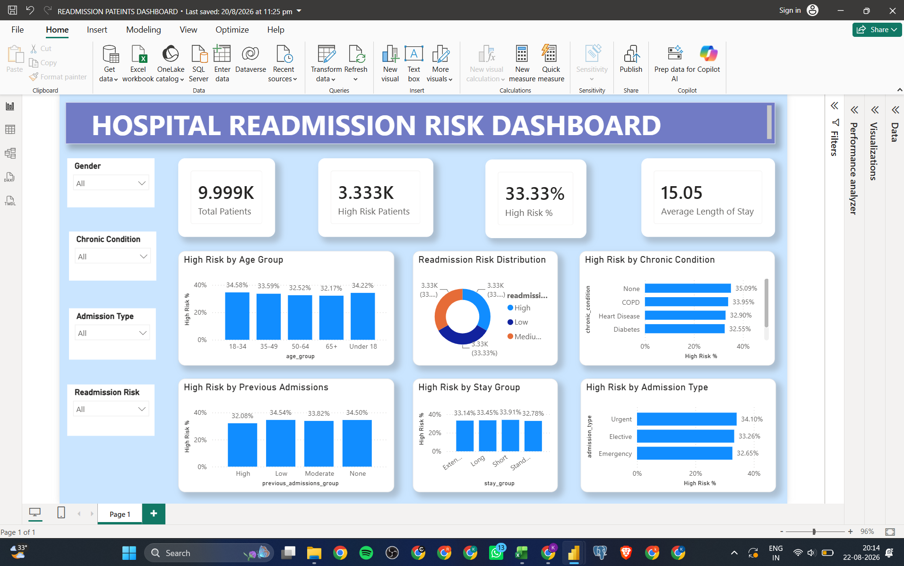

# Hospital Readmission Risk Analysis

## 📊 Project Overview

Hospital Readmission Risk Analysis is a healthcare analytics project created to analyze patient-level data and identify patterns related to readmission risk.

The project uses Excel, Power BI, and DAX to prepare, analyze, and visualize patient data through an interactive dashboard.

## 🎯 Business Objective

The main objective of this project was to analyze patient characteristics and identify patterns associated with higher readmission risk.

The analysis focuses on factors such as:

- Age Groups
- Chronic Conditions
- Previous Admissions
- Length of Stay
- Stay Groups
- Admission Types
- BMI-related Analysis

The analysis helps identify patient groups with higher readmission risk and provides insights that can support healthcare analysis and decision-making.

## 🛠️ Tools & Technologies

- Excel
- Power BI
- DAX

## 📁 Dataset

The dataset contains 9,999 patient records.

The Excel workbook contains the raw data and the cleaned/processed data used for the analysis.

## 📌 Key KPIs

The dashboard tracks important healthcare metrics including:

- Total Patient Records: 9,999
- High-Risk Patients: 3,333
- High-Risk Percentage: 33.33%
- Average Length of Stay: 15.05 days

## 📈 Dashboard

The interactive Power BI dashboard provides an overview of patient readmission risk and allows analysis across different patient and admission characteristics.

## 🔍 Analysis Areas

The project analyzes readmission risk across:

- Age Groups
- Chronic Conditions
- Previous Admissions
- Length-of-Stay Groups
- Admission Types
- BMI-related Categories

## 💡 Business Value

The analysis provides a consolidated view of patient risk patterns and can help healthcare teams identify groups that may require further investigation for readmission risk and patient management.

## 📂 Project Files

- `Hospital_Readmission_Dashboard.png` – Power BI dashboard screenshot
- `Hospital_Readmission.pbix` – Power BI dashboard file
- `Hospital_Readmission_Data.xlsx` – Excel workbook containing raw and cleaned/processed data
- `README.md` – Project documentation

## 🚀 Conclusion

Hospital Readmission Risk Analysis demonstrates how patient-level data can be analyzed and presented through Power BI to understand readmission risk patterns and support data-driven healthcare analysis.
